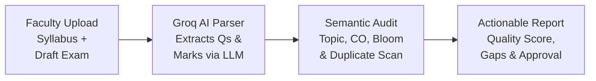
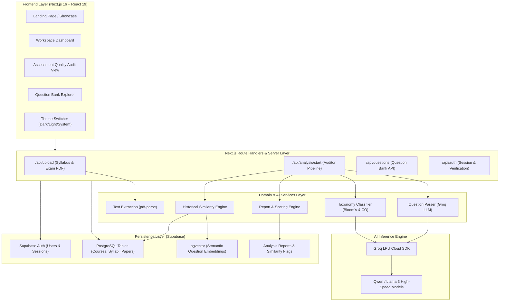

<div align="center">

# 🏛️ Faculty Palace

### *AI-Powered Academic Assessment Auditing & Quality Intelligence Workspace*

**Better exams begin with better questions.**  
Faculty Palace helps academic teams audit draft assessments, align questions to Course Outcomes (COs), balance Bloom's Taxonomy cognitive levels, detect syllabus coverage gaps, and prevent historical question repetition before papers reach students.

[](https://nextjs.org/)
[](https://react.dev/)
[](https://www.typescriptlang.org/)
[](https://groq.com/)
[](https://supabase.com/)
[](https://tailwindcss.com/)
[](https://opensource.org/licenses/MIT)

[Explore Overview](#-key-features) • [System Architecture](#-system-architecture) • [Role Matrix](#-role-based-access-control-rbac) • [Scoring Algorithm](#-quality-scoring-engine) • [Quickstart](#-getting-started) • [API Reference](#-api-routes)

---

</div>

## 📌 Table of Contents

- [The Problem](#-the-problem)
- [The Solution](#-the-solution)
- [Key Features](#-key-features)
- [System Architecture](#-system-architecture)
- [Role-Based Access Control (RBAC)](#-role-based-access-control-rbac)
- [Quality Scoring Engine](#-quality-scoring-engine)
- [Bloom's Taxonomy & Cognitive Profiling](#-blooms-taxonomy--cognitive-profiling)
- [Tech Stack](#-tech-stack)
- [Repository Structure](#-repository-structure)
- [Getting Started](#-getting-started)
  - [Prerequisites](#prerequisites)
  - [Environment Configuration](#environment-configuration)
  - [Database Setup](#database-setup)
  - [Running the Application](#running-the-application)
  - [Demo Accounts](#demo-accounts)
- [API Routes](#-api-routes)
- [Roadmap](#-roadmap)
- [Contributing](#-contributing)
- [License](#-license)

---

## 🎯 The Problem

In universities and higher education institutions, creating examination papers is often an isolated, manual, and unstandardized process:

1. **Cognitive Bias (Low-Level Memorization):** Instructors unintentionally tilt exam questions toward basic recall (*Remember* and *Understand*), starving exams of higher-order analysis, design, and problem-solving (*Apply*, *Analyze*, *Evaluate*, *Create*).
2. **Syllabus Coverage Blindspots:** Questions frequently concentrate on a few favorite course topics while omitting essential chapters and core Course Outcomes (COs).
3. **Accidental Duplicate Questions:** Instructors inadvertently reuse identical or lightly reworded questions from prior semesters without realizing students have already memorized past papers.
4. **Disjointed Moderation Workflows:** Department Heads and External Examiners lack unified tooling to inspect cognitive balance, verify syllabus compliance, and sign off on exam papers with actionable revision requests.

---

## 💡 The Solution

**Faculty Palace** transforms exam vetting into an automated, data-driven, and collaborative intelligence workflow.



Within seconds, the platform:
- **Segments** raw PDF/text exams into discrete questions with associated marks.
- **Maps** every question to defined syllabus topics and Course Outcomes (CO1–CO5).
- **Classifies** cognitive complexity according to Bloom's Revised Taxonomy.
- **Cross-references** institutional archives for historical semantic duplicates.
- **Calculates** an overall assessment quality score (0–100) with prioritized recommendations.
- **Empowers** Department Heads to approve final printable drafts or request revisions.

---

## ✨ Key Features

| Feature | Description |
| :--- | :--- |
| ⚡ **Sub-Second Groq AI Parsing** | Leverages high-throughput Groq LPU inference for instant question extraction, mark segmentation, and topic classification with strict JSON schemas and automatic error-retry fallbacks. |
| 🧠 **Bloom's Cognitive Distribution** | Categorizes every question across the 6 Bloom's levels (*Remember, Understand, Apply, Analyze, Evaluate, Create*), computing real-time higher-order reasoning benchmarks. |
| 🎯 **Course Outcome (CO) Alignment** | Visualizes mark distribution across learning outcomes (CO1–CO4), alerting instructors when critical competencies are underrepresented. |
| 🔍 **Historical Overlap & Similarity Guard** | Employs token intersection and vector similarity against archived semester papers to flag questions with $\ge 75\%$ historical similarity. |
| 📊 **Transparent Quality Scoring (0–100)** | A deterministic composite score combining syllabus coverage ratio ($55\%$), higher-order cognitive balance ($45\%$), and repetition penalties. |
| 👥 **Tri-Role Academic RBAC** | Dedicated role profiles for **Course Instructors**, **Department Heads**, and **External Examiners** with granular permission gates. |
| 📚 **Interactive Question Bank** | Searchable repository filterable by Bloom's level, Course Outcome, exam year, and historical similarity flags. |
| 🌓 **Bespoke Dynamic Theming** | Native Light, Dark, and System theme engine with custom CSS tokens, smooth transitions, and segmented controls. |

---

## 🏗️ System Architecture



---

## 👥 Role-Based Access Control (RBAC)

Faculty Palace mirrors real-world university governance with three primary roles:

```
                  ┌─────────────────────────────────────────┐
                  │          Department Head (Admin)        │
                  │   Full Audit & Institutional Approval   │
                  └────────────────────┬────────────────────┘
                                       │
            ┌──────────────────────────┴──────────────────────────┐
            ▼                                                     ▼
┌───────────────────────┐                             ┌───────────────────────┐
│   Course Instructor   │                             │   External Examiner   │
│   (Faculty)           │                             │   (Reviewer)          │
│   • Upload materials  │                             │   • Read-only audit   │
│   • Run AI assessment │                             │   • Benchmark review  │
│   • Edit Question Bank│                             │   • Quality oversight │
└───────────────────────┘                             └───────────────────────┘
```

| Permission / Capability | Department Head (`admin`) | Course Instructor (`faculty`) | External Examiner (`reviewer`) |
| :--- | :---: | :---: | :---: |
| **Upload Syllabus & Draft Exams** | ✅ | ✅ | ❌ |
| **Run Real-Time AI Assessments** | ✅ | ✅ | ❌ |
| **View Assessment Quality Reports** | ✅ All Courses | ✅ Own Courses | ✅ Approved Papers |
| **Manage & Add Questions to Bank** | ✅ Global Bank | ✅ Course Modules | ❌ Read-Only |
| **Approve Final Exam Papers** | ✅ | ❌ | ❌ |
| **Request Revisions with Feedback** | ✅ | ❌ | ❌ |
| **Audit Cognitive & Outcome Matrices**| ✅ | ✅ | ✅ |

---

## 📐 Quality Scoring Engine

The Assessment Quality Score is an algorithmic metric evaluated between **0 and 100** that synthesizes syllabus completeness, cognitive depth, and historical independence:

$$\text{Quality Score} = \max\left(0, \, \min\left(100, \, (\text{Coverage Score} + \text{Cognitive Score}) - \text{Repetition Penalty}\right)\right)$$

### 1. Syllabus Coverage Score ($55\%$ Weight)
Evaluates what fraction of mandatory course syllabus topics are addressed by the exam paper:
$$\text{Coverage Score} = \left(\frac{\text{Unique Topics Covered}}{\max(\text{Total Syllabus Topics}, 1)}\right) \times 55$$

### 2. Cognitive Depth Score ($45\%$ Weight)
Rewards assessments emphasizing higher-order thinking (*Apply, Analyze, Evaluate, Create*):
$$\text{Cognitive Score} = \left(\frac{\sum \text{Marks for Higher-Order Bloom's}}{\text{Total Exam Marks}}\right) \times 45$$

### 3. Repetition Penalty
Protects assessment freshness by deducting **4 points** per detected historical duplicate match ($\text{similarity} \ge 0.75$), capped at **20 points**:
$$\text{Repetition Penalty} = \min(\text{Flagged Duplicate Matches} \times 4, \, 20)$$

---

## 🧠 Bloom's Taxonomy & Cognitive Profiling

Each segmented question is automatically classified across the 6 cognitive domains of Bloom's Revised Taxonomy:

```
  HIGHER-ORDER THINKING (Target: ≥ 35% of Total Marks)
  ▲
  │  [06] CREATE     — Formulate architectures, design algorithms, synthesize schemas
  │  [05] EVALUATE   — Critique protocols, assess trade-offs, defend security postures
  │  [04] ANALYZE    — Differentiate models, examine fault cases, deconstruct queries
  │  [03] APPLY      — Write queries, execute computations, implement algorithms
  │  ─────────────────────────────────────────────────────────────────────────────
  │  [02] UNDERSTAND — Explain concepts, contrast methodologies, describe workflows
  │  [01] REMEMBER   — Define terms, recall properties, identify notations
  ▼
  LOWER-ORDER THINKING
```

---

## 💻 Tech Stack

| Category | Technology | Purpose |
| :--- | :--- | :--- |
| **Framework** | [Next.js 16 (App Router)](https://nextjs.org/) | Server Components, Route Handlers, SSR, fast client transitions |
| **Frontend Library** | [React 19](https://react.dev/) | Component architecture, responsive state management |
| **Language** | [TypeScript 5](https://www.typescriptlang.org/) | End-to-end type safety across schemas, models, and UI |
| **Styling** | [Tailwind CSS v4](https://tailwindcss.com/) + Custom CSS | Design token system, fluid layouts, dark/light themes |
| **AI / LLM Engine** | [Groq SDK](https://groq.com/) (`groq-sdk`) | Sub-second question extraction and classification with schema adherence |
| **Database** | [Supabase PostgreSQL](https://supabase.com/) | Relational store for courses, syllabi, questions, and reports |
| **Vector Search** | [pgvector](https://github.com/pgvector/pgvector) | Vector embeddings for semantic similarity search |
| **Authentication** | [Supabase SSR](https://supabase.com/docs/guides/auth/server-side) | Role-based authentication, cookies, and Row-Level Security (RLS) |
| **Document Parser** | [`pdf-parse`](https://www.npmjs.com/package/pdf-parse) | Fast local PDF text extraction for syllabi and exam papers |
| **Icons** | [Lucide React](https://lucide.dev/) | Clean, accessible vector icons |

---

## 📁 Repository Structure

```text
faculty-palace/
├── app/
│   ├── api/
│   │   ├── analysis/          # AI assessment execution & report endpoints
│   │   │   ├── [id]/          # Retrieve specific analysis report
│   │   │   └── start/         # Start full AI audit pipeline
│   │   ├── auth/              # Authentication & session verification
│   │   ├── questions/         # Question bank retrieval & management
│   │   └── upload/            # Syllabus and exam paper file upload
│   │       ├── exam/          # Draft exam ingestion & text extraction
│   │       └── syllabus/      # Course syllabus document processing
│   ├── components/            # Reusable UI widgets (ThemeSwitcher, etc.)
│   ├── context/               # React contexts (AuthContext, ThemeContext)
│   ├── dashboard/             # Dedicated workspace dashboard route
│   ├── login/                 # Authentication sign-in portal
│   ├── register/              # New faculty onboarding & account creation
│   ├── globals.css            # Design token system, animations & responsive styles
│   ├── layout.tsx             # Root HTML layout with font optimization & theme scripts
│   └── page.tsx               # Main application shell (Landing + Interactive Workspace)
├── database/
│   ├── assessiq_schema.sql    # Relational assessment schema & pgvector definitions
│   ├── seed/                  # Historical questions & course outcomes seed datasets
│   └── supabase.sql           # Supabase Auth profiles, RLS policies, and triggers
├── lib/
│   ├── ai/
│   │   ├── aiService.ts       # Groq client wrapper, JSON validator, telemetry logger
│   │   ├── groqClient.ts      # Groq instance manager and default model configuration
│   │   └── promptTemplates/   # Strict JSON schema prompt templates
│   ├── services/
│   │   ├── analysisStorage.service.ts      # Local/cached analysis state fallback
│   │   ├── assessmentPersistence.service.ts # Supabase database persistence logic
│   │   ├── questionAnalysis.service.ts     # Topic & Bloom's classification logic
│   │   ├── questionParser.service.ts       # Regex & LLM question segmentation
│   │   ├── report.service.ts               # Algorithmic quality score generator
│   │   ├── similarity.service.ts           # Token & vector duplicate detection
│   │   ├── textExtraction.service.ts       # PDF & text file parsing engine
│   │   └── uploadStorage.service.ts        # File storage & metadata records
│   └── supabase/
│       ├── admin.ts           # Elevated Supabase Service Role client
│       ├── auth.ts            # User profile and session helpers
│       ├── client.ts          # Browser Supabase client
│       └── server.ts          # Server-side cookie-based SSR Supabase client
├── public/                    # Static assets & icons
├── .env.example               # Template environment configuration
├── package.json               # Dependencies and scripts
└── tsconfig.json              # TypeScript compiler configuration
```

---

## 🚀 Getting Started

### Prerequisites

- **Node.js**: `v20.x` or higher
- **Package Manager**: `npm`, `pnpm`, or `bun`
- **Supabase Account**: Free project at [supabase.com](https://supabase.com)
- **Groq Cloud API Key**: Free key from [console.groq.com](https://console.groq.com/)

---

### Environment Configuration

1. Clone the repository and navigate into the project directory:

```bash
git clone https://github.com/sajid-25/faculty-palace.git
cd faculty-palace
```

2. Copy the example environment template:

```bash
cp .env.example .env.local
```

3. Fill in your credentials in `.env.local`:

```env
# Supabase Configuration (Dashboard > Project Settings > API)
NEXT_PUBLIC_SUPABASE_URL=https://your-project-id.supabase.co
NEXT_PUBLIC_SUPABASE_ANON_KEY=your-supabase-anon-key
SUPABASE_SERVICE_ROLE_KEY=your-supabase-service-role-key

# Groq AI Inference (https://console.groq.com/keys)
GROQ_API_KEY=gsk_your_groq_api_key_here
GROQ_MODEL=qwen/qwen3.8-27b
```

---

### Database Setup

1. Open your **Supabase Dashboard > SQL Editor**.
2. Run `database/supabase.sql` to configure:
   - User profile auto-creation trigger on signup
   - Row-Level Security (RLS) policies
   - Core tables (`courses`, `syllabi`, `exam_papers`)
3. Run `database/assessiq_schema.sql` to configure:
   - Detailed assessment tables (`course_outcomes`, `syllabus_topics`, `questions`, `question_analysis`, `similarity_flags`, `analysis_reports`)
   - `pgvector` vector extension and cosine similarity indexes
4. *(Optional)* Seed historical question banks using `database/seed/historical_questions.json`.

---

### Running the Application

1. Install project dependencies:

```bash
npm install
```

2. Start the local Next.js development server:

```bash
npm run dev
```

3. Open your browser and navigate to:
   ```text
   http://localhost:3000
   ```

---

### Demo Accounts

To test the application across different academic roles without registering individual accounts:

1. In **Supabase Dashboard > Authentication > Users**, create three users with password:  
   `AssessIQDemo123!`

| Role | Name | Email | Permissions |
| :--- | :--- | :--- | :--- |
| **Department Head** | Dr. Sarah Rahman | `sarah.rahman@institution.edu` | Full administrative & approval oversight |
| **Course Instructor** | Arjun Mehta | `arjun.mehta@institution.edu` | Assessment upload, AI audit & question bank |
| **External Examiner** | Prof. David Chen | `david.chen@external-board.edu` | Read-only moderation and quality audit |

2. Assign their roles by running this in the **Supabase SQL Editor**:

```sql
update public.profiles set role = 'admin' where id = (select id from auth.users where email = 'sarah.rahman@institution.edu');
update public.profiles set role = 'faculty' where id = (select id from auth.users where email = 'arjun.mehta@institution.edu');
update public.profiles set role = 'reviewer' where id = (select id from auth.users where email = 'david.chen@external-board.edu');
```

---

## 🔌 API Routes

| Method | Route | Description | Auth Required |
| :--- | :--- | :--- | :---: |
| `POST` | `/api/upload/syllabus` | Ingests and parses syllabus text/PDF for course topics | Yes (`faculty`, `admin`) |
| `POST` | `/api/upload/exam` | Uploads draft exam paper, extracts raw text & metadata | Yes (`faculty`, `admin`) |
| `POST` | `/api/analysis/start` | Executes the complete Groq AI audit and persistence pipeline | Yes (`faculty`, `admin`) |
| `GET` | `/api/analysis/[id]` | Retrieves detailed assessment report by exam paper ID | Yes |
| `GET` | `/api/questions` | Returns question bank items with Bloom's & CO tags | Yes |
| `GET` | `/api/auth/verify` | Validates session token and returns active role profile | Yes |

---

## 🗺️ Roadmap

- [x] **Phase 1: Ingestion & Parsing Engine** — PDF parsing, Groq LLM question segmentation, mark extraction.
- [x] **Phase 2: Academic Intelligence Core** — Bloom's Taxonomy classification, Course Outcome mapping, syllabus coverage analysis.
- [x] **Phase 3: Similarity & Duplicate Guard** — Token & embedding matching against historical exams.
- [x] **Phase 4: Multi-Role Governance** — Department Head approval/revision workflows and External Examiner portals.
- [x] **Phase 5: Dynamic UI & Theming** — Dark/Light theme switcher, interactive KPI cards, and responsive layouts.
- [ ] **Phase 6: Official PDF/LaTeX Export** — One-click generation of formatted, print-ready university exam papers.
- [ ] **Phase 7: LMS Integration** — Two-way synchronization with Canvas, Blackboard, and Moodle.
- [ ] **Phase 8: Multi-Section Federated Analytics** — Historical trends and cognitive consistency across multiple instructors teaching the same course.

---

## 🤝 Contributing

Contributions, feedback, and suggestions are welcome!

1. Fork the repository
2. Create your feature branch (`git checkout -b feature/amazing-feature`)
3. Commit your changes (`git commit -m 'feat: add amazing feature'`)
4. Push to the branch (`git push origin feature/amazing-feature`)
5. Open a Pull Request

---

## 📄 License

This project is licensed under the **MIT License** — see the [LICENSE](LICENSE) file for details.

---

<div align="center">

Built with 💡 for academic excellence and thoughtful assessment design.  
**Faculty Palace** © 2026

</div>
